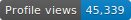

<h1 align="center"><a href="#">
<h2 align="center">Hi,  I'm Helen Laganzo — aka Helena Lags</h2>

### <h3 align="center">[Certified Tarot Reader](https://www.facebook.com/SLRtarot).</h3>

 

## 🙋‍♂️ About Me

- ✨ My Tarot Business name is Shining Light Readings
  
- 🧠 I'm currently learning Spanish

- 🤖 Someday, I'd like to work with various individuals in the IT field
  
- 🤡 Fun fact: I love to paint and draw

 

## My Music Playlist:

 

    <a href="https://github.com/HelenaLags/github-readme-streak-stats">
        

 

## 📊 My Github Stats

   
    
  
   

  <b>Note:</b> Top languages is only a metric of the languages my public code consists of and doesn't reflect experience or skill level.

 

 

## Connect with me:

 

## ❤ Views and Followers

